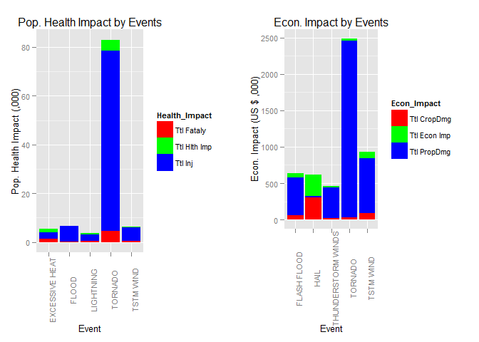
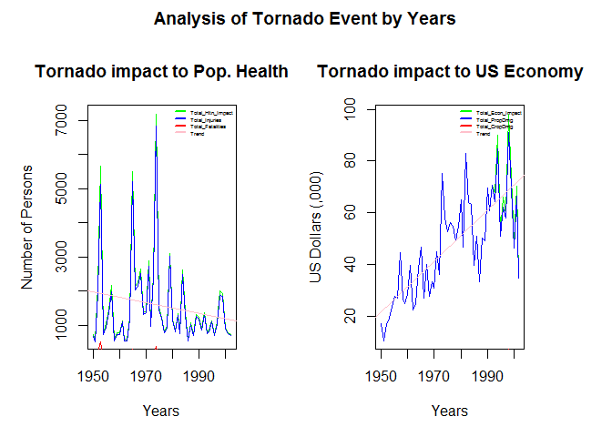

# Weather Impact on Population Health and the Economy
Nicholas Wee  
Wednesday, March 18, 2015  


# Synopsis
This reports looks at Weather Events that have significant impact on Population Health and the Economy.  From the period of 1950 to 2011, summary analysis on the data from US National Weather Services tells us that Tonardo alone, has resulted in over **83,014** injuries and fatalities, and over **US$2,485,323** of losses in Property and Crop Damages.  
  
This reports provides a summary analysis that attempts to answer the following two questions:  
1.  Which types of events, across the United States, are most harmful with respect to population health (in terms of injuries and fatalities), and  
2.  Which types of events, across the United States, have the greatest economic consequences (in terms of Property and Crop Damages)  
  
This reports provides the results of the analysis to answer the above two questions, and the details in processing the data, and resulting data to support the answers.
  
# Data Processing
This section outlines how the data is processed for its use subsequently for analysis.
  
## Dataset Source
The data for this assignment come in the form of a comma-separated-value file compressed via the bzip2 algorithm to reduce its size. You can download the file from the course web site:  
  
https://d396qusza40orc.cloudfront.net/repdata%2Fdata%2FStormData.csv.bz2.  
  
The file is downloaded via the script below and stored into a subfolder "data".  Before the data is loaded into working datasets, the file is uncompressed using the bzip2 uncompression function found in the R library "R.utils".  

Then the contents of the file is read into the data frame "storm_data", using the headers provided in the file, and reading all strings as raw, rather than as factors.  

The data source processing logic can be found below here:  


```r
## Define the input source file
fileURL <- "https://d396qusza40orc.cloudfront.net/repdata%2Fdata%2FStormData.csv.bz2"

## Create data folder and target file if it doesn't exists
if (!file.exists("./data")) dir.create("./data")

targetURL <- "./data/repdata_data_StormData.csv.bz2"

## Download the file from the URL provided in the project brief
if (!file.exists(gsub("[.]bz2$", "", targetURL))) {
    setInternet2(TRUE)
    download.file(fileURL, destfile = targetURL)
    bunzip2(targetURL)
}
targetURL <- gsub("[.]bz2$", "", targetURL)

suppressWarnings({
storm_data <- read.csv(targetURL, header = TRUE, stringsAsFactor = FALSE, 
                       na.strings = "?")
})
```

## Data Cleaning Performed (or Not Peformed)
From preliminary analysis of the EVTYPE (Event Type) from the dataset, there is one NA value found in this field.  As the value involved in this observation is small, there would not be any significant impact in removing this observation from further analysis.   
  
It is also observed in the preliminary analysis of the EVTYPE, it is found that there are leading and trailing spaces in the values of the field. As such, there is a need to remove these leading and trail spaces to avoid miscalculating (e.g. summation) any data that would be based on the EVTYPE.  This field, EVTYPE, is converted into a factor to support easier segmentation if required.     
  
Other observations also include that the EVTYPE values include classification that are not really weather related, e.g. SUMMARY..., misspelling/different spelling of classifications, etc.  In addition, though the National Weather Service provides for 48 Events classification, there is no guidance provided on how the current 900 over classifications are to be matched against these 48 Event classifications.  Some are impossible to match, and attempts to do so may result in misclassification.  For example, which of the 48 Event should the following samples to match to:  
1.  Apache County (is this a place or a weather condition?)  
2.  Black Ice (is this a weather condition or road condition?)  
3.  Blizzard/Heavy Snow (should this be classifed as Blizzard or Heavy Snow)  
4.  Bush Fire  
5.  Cold and Wet  
6.  Cool and Wet  
7.  Dam Break  
8.  Dam Failure (is this a crisis or a weather condition?)  
9.  Driest Month (in comparison to??)  
10.  Dry (and all its variations)  
11.  and so forth...  
  
As such, it may not be prudent to exercise extreme data cleanning, and the resulting reclassification (and force fitting) does not guarantee that the analysis would be significantly more accurate.  A gentler approach has been taken to clean the obvious (missing from source), and tidying of leading/trailing spaces, and to focus on impact to Population Health and to the Economy.

The following are the basic processing performed for some basic level of data sanity.    


```r
## Remove the NA EVTYPE from storm_data
storm_data <- storm_data[!is.na(storm_data$EVTYPE), ]

## Clean the Even types.  Visual exploration had shown that it has issues such as
## leading and trailing spaces, same event but using different "codes", etc.
# Change EVTYPE to upper case and triming of leading and trailing spaces
storm_data$EVTYPE <- as.factor(toupper(trim(storm_data$EVTYPE)))
```


## Data Aggregation and Summarisation
The following has been performed to convert the measured data into analytic data to support our analysis:  
1.  The data is grouped by event type and aggregated by the total injuries, total fatalities, and the aggregate of the sum of both of these to determine the major contributing events that impacts Population Health.  The top five (5) were identified.  The reason why only the top 5 were select is because after these, the numbers involved is comparatively low, especially if we were to average the cases over 1950 to 2011.   
2.  The data is grouped by event type and aggregated by the total Property Damages, total Crop Damages, and the aggregate of the sum of both of these to determine the major contributing events that greatest economic consequences. The top five (5) were identified. The reason why only the top 5 were select is because after these, the dollar value involved is comparatively low, especially if we were to average the cases over 1950 to 2011.  
3.  The Begin Date of the Event is used to generate a Year field: BGN_DATE_YR, so that significant events or event and their impact can be tracked across multiple years to determine if there are any particular trend.  
4.  The data is further grouped by event type and year (created in step 1) and aggregated by total injuries, total fatalities, and by the sum of both of these fields for Population Health Impact, and by total Property Damages, total Crop Damages, and the sum of these two fields for the economic consequences.  
  

```r
## Measure for "harmful to population health" is the sum of total fatalities and total injuries
## Measure for "greatest economic consequences" is the sum of total property and total crop damages

## Two summaries are taken for initial analysis: 
#  The first sums the measures grouped by events but regardless of years
storm_summary0 <- storm_data %>% 
    group_by(EVTYPE) %>% 
    summarise(Total_Fatalities = sum(FATALITIES), 
              Total_Injuries = sum(INJURIES),
              Total_Hlth_Impact = sum(FATALITIES + INJURIES),
              Total_PropDmg = sum(PROPDMG), 
              Total_CropDmg = sum(CROPDMG),
              Total_Econ_Impact = sum(PROPDMG + CROPDMG))

## Create a year to allow analysis over the years for the same event to 
## understand the trend of the event in terms of impact
storm_data$BGN_DATE_YR <- as.integer(year(as.Date(storm_data$BGN_DATE, format="%m/%d/%Y %H:%M:%S")))

#  The second sums the measures group by events and years
storm_summary1 <- storm_data %>% 
    group_by(EVTYPE, BGN_DATE_YR) %>% 
    summarise(Total_Fatalities = sum(FATALITIES), 
              Total_Injuries = sum(INJURIES),
              Total_Hlth_Impact = sum(FATALITIES + INJURIES),
              Total_PropDmg = sum(PROPDMG), 
              Total_CropDmg = sum(CROPDMG),
              Total_Econ_Impact = sum(PROPDMG + CROPDMG))

# Analysing top Events in terms of Total_Hlth_Impact
storm_sum_health <- arrange(storm_summary0, desc(Total_Hlth_Impact))
storm_sum_health <- storm_sum_health[1:5, ] # Take top 5 

# Analysing top Events in terms of Total_Econ_Impact
storm_sum_econ <- arrange(storm_summary0, desc(Total_Econ_Impact))
storm_sum_econ <- storm_sum_econ[1:5, ] # Take top 5
```
# Results

The top five (5) most impactful events to Population Health are:  


```r
print(select(storm_sum_health, EVTYPE, Total_Injuries, Total_Fatalities, Total_Hlth_Impact))
```

```
## Source: local data frame [5 x 4]
## 
##           EVTYPE Total_Injuries Total_Fatalities Total_Hlth_Impact
## 1        TORNADO          78459             4555             83014
## 2          FLOOD           6491              231              6722
## 3      TSTM WIND           5960              435              6395
## 4 EXCESSIVE HEAT           4106             1337              5443
## 5      LIGHTNING           3166              484              3650
```
  
The top five (5) events that have significant consequences to the Economy are:  


```r
print(select(storm_sum_econ, EVTYPE, Total_PropDmg, Total_CropDmg, Total_Econ_Impact))
```

```
## Source: local data frame [5 x 4]
## 
##               EVTYPE Total_PropDmg Total_CropDmg Total_Econ_Impact
## 1            TORNADO     2452535.4      32787.72         2485323.1
## 2          TSTM WIND      843568.3      84587.15          928155.5
## 3        FLASH FLOOD      573774.4      62027.49          635801.9
## 4               HAIL      321840.7     299814.47          621655.2
## 5 THUNDERSTORM WINDS      446293.2      18684.93          464978.1
```
The following figure provides a good overview of the Events and their impact and consequences.  


A perspective and comparison between the top five (5) events for both Population Health and Economic consequences can be seen in the chart below:  

 
  
From the plots above, it can be seen that Tornados have the greatest impact on both Population Health and the Economy from 1950 to 2011, across the United States (US), measured in terms of total number of injuries and fatalities, and the total US dollar loss due to Property and Crop damages.  
  
The impact to Population Health is a total of **83,014 injuries and fatalities** from 1950 to 2011, or _78,459_ injuries and _4,555_ fatalities.  This is quite significant in comparison with the next highest impactful event to Population Health, Floods, that results in a total of _6,722_ injuries of fatalities.  This is slightly more than ten (10) times the number of injuries and fatalities.
    
Tornados have an equally significant impact to the US economy, in terms of total dollar value loss to Property and Crops, with the total loss of approximately **US$2,485,323** from 1950 to 2011, comprising of approximately _US$2,452,535_ (rounded) in total Property damages and _US$32,788_ (rounded).  In comparison with the next highest impactful event to the US economy, that is Thunderstorm Wind (or TSTM WIND), US$928,156 (rounded). 
  
**Special Note:**  As there are classification data errors, there is another classification of THUNDERSTORM WINDS, the total of the two classification for the same event of US$1,393,134 is still only 56% of the economic loss due to Tornados.  However, after being said, there could be further misclassification of Thunderstorm Wind events, and, once classified correctly, this event may overtake Tornado events in terms of consequences to the US economy. 

## Further Analysis on Results
For further analysis of the most significant event, Tornado, a subset from the storm summary data by years is extracted.  This will be used to plot both the Impact of Tornado on Population Health and Economy across the years.  


 
  
As it can be seen from the plots above, the impact of Tornado events on Population Health have been decreasing through the years, in terms of injuries and fatalities to persons.  Pershaps, this is due to being better prepared for such events.  However, the cost of such an event is increasing through the years, and mainly contributed by Property Damages (as the plots almost mirrors the total cost of damages).  The trend line shows that it may, on average, rise to more than tripled the cost of the 1950s.  What would be the cause of this?

# Further Research and Activities
## New Areas for Research
Further research can be conducted to determine the factors that contributes to this increasing cost due to Property Damages.  For example, could the scale of such an event be larger than previous years, and thus the extend of Property Damages are greater, or could it be that Property built in recent years are not designed to deal with Tornado events, or are Tornados hitting areas that are more densely built-up and thus causing far more extensive damages, or is it not one but multiple contributing factors.
  
## Needed Supporting Activities
To support new areas of research into Impact of Weather Events on Population or Economy, it is critical that the data file, in particular in the data classification values to be cleaned up in order for more meaning data analysis to be conducted, and in a more conclusive manner.

###
